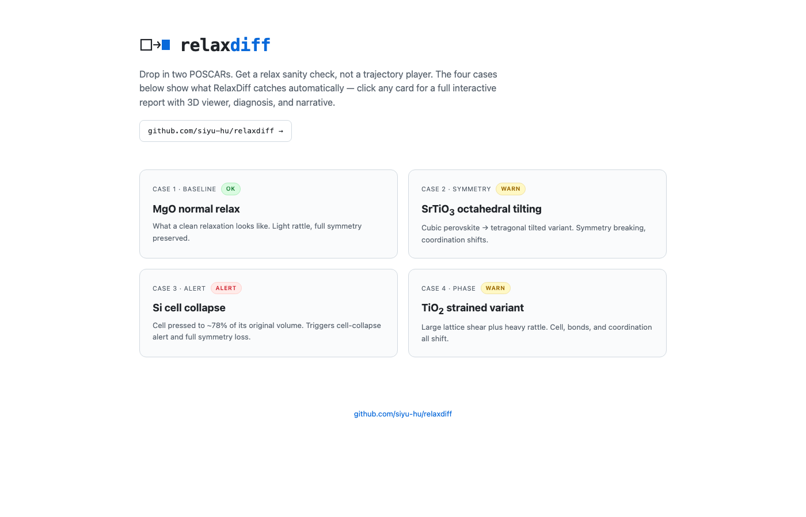
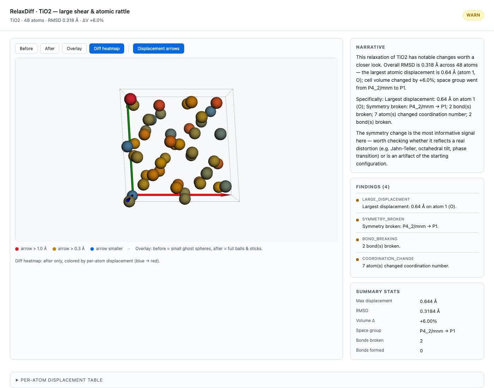
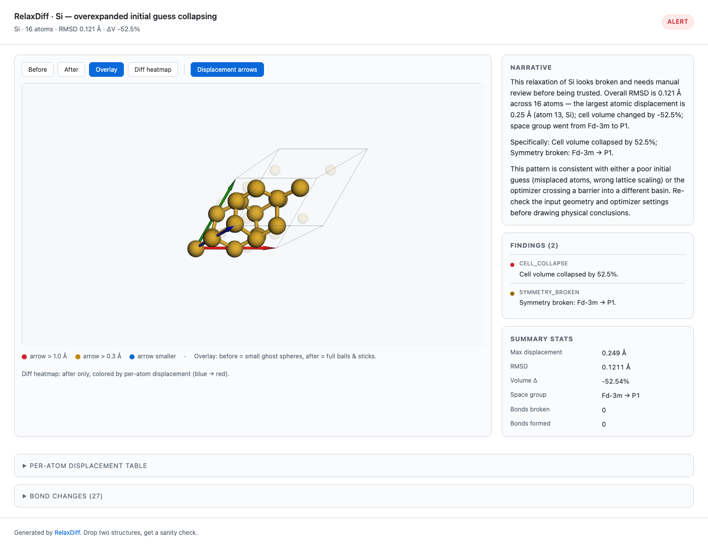

<p align="center">
  
</p>

<h3 align="center">Drop in two POSCARs. Get a relax sanity check, not a trajectory player.</h3>

<p align="center">
  <a href="https://siyu-hu.github.io/relaxdiff/"><b>Live demo</b></a> ·
  <a href="#showcase">Showcase</a> ·
  <a href="#install">Install</a> ·
  <a href="#how-it-works">How it works</a>
</p>

<p align="center">
  <a href="https://siyu-hu.github.io/relaxdiff/">
    
  </a>
</p>

---

Most crystal structure viewers let you **see** a relaxation — atoms in a cell, maybe a trajectory player.

**RelaxDiff tells you whether the relaxation looks reasonable.**
It diffs two structures along every axis a researcher cares about — displacement, bonds, coordination, cell, symmetry — and writes a short narrative explaining what likely happened. One command. One self-contained HTML report. No server, no toolchain.

```bash
relaxdiff before.vasp after.vasp -o report.html
```

## What you get

<table>
  <tr>
    <td width="50%">
      <b>Interactive 3D diff viewer</b><br/>
      Toggle Before / After / Overlay / Diff heatmap. In <i>Diff heatmap</i> mode every atom is colored by how far it moved — small movement blue, big movement red — so problem atoms jump out at a glance.<br/><br/>
      
    </td>
    <td width="50%">
      <b>Severity-tagged diagnosis</b><br/>
      Eleven rules turn raw geometry into severity-tagged findings: large displacement, runaway atoms, cell collapse, bond breaking, coordination changes, broken or elevated symmetry, large shear. Every report gets an overall OK / INFO / WARN / ALERT chip.<br/><br/>
      
    </td>
  </tr>
  <tr>
    <td>
      <b>LLM narrative (optional)</b><br/>
      Reads the structured diagnosis JSON — never raw coordinates — and produces a three-paragraph plain-English read of the result, citing specific atom indices. Backed by <a href="https://platform.deepseek.com/">DeepSeek</a> (OpenAI-compatible). Without an API key, a deterministic template covers the same ground.
    </td>
    <td>
      <b>Adaptive symmetry detection</b><br/>
      Runs a tolerance scan with <code>spglib</code> and picks an effective <code>symprec</code> automatically, so a small rattle doesn't get misread as full P1 collapse but a real distortion still trips the rule.
    </td>
  </tr>
</table>

## Showcase

Four predefined cases, auto-built and deployed to the gallery:

| Case | Severity | What it shows |
|---|---|---|
| [MgO normal relax](https://siyu-hu.github.io/relaxdiff/cases/mgo_normal.html) |  | Clean baseline — what an unremarkable relaxation looks like |
| [SrTiO₃ octahedral tilting](https://siyu-hu.github.io/relaxdiff/cases/srtio3_tilting.html) |  | Cubic → tetragonal-tilted variant; symmetry breaking + coordination shifts |
| [Si cell collapse](https://siyu-hu.github.io/relaxdiff/cases/collapse.html) |  | Cell pressed to ~78% of original volume; full symmetry loss |
| [TiO₂ strained variant](https://siyu-hu.github.io/relaxdiff/cases/tio2_phase.html) |  | Large shear + heavy rattle; broken bonds + coordination changes |

Rebuild them locally in seconds (no DFT, no ML potential — just geometric construction):

```bash
python examples/build.py
```

## Install

```bash
python -m venv .venv && source .venv/bin/activate
pip install -e .
```

## Use

```bash
relaxdiff before.vasp after.vasp -o report.html
```

Open `report.html` in any browser. Self-contained, no server required. Works on POSCAR / CIF / extxyz / pymatgen JSON / ASE Atoms.

### Options

```
--title TEXT             Report title shown in the header
--no-llm                 Skip the LLM narrative, use the deterministic template
--json PATH              Also dump structured diagnosis as JSON
--threshold-displacement Override the default 0.5 Å warn threshold (Å)
```

### LLM narrative

The narrative layer talks to **DeepSeek**'s OpenAI-compatible API by default.

```bash
cp .env.example .env
# edit .env and paste your DEEPSEEK_API_KEY
export $(grep -v '^#' .env | xargs)
relaxdiff before.vasp after.vasp -o report.html
```

Without `DEEPSEEK_API_KEY` (or with `--no-llm`), the report falls back to a deterministic three-paragraph template. No internet required.

Want to swap providers? `RELAXDIFF_LLM_MODEL` and `RELAXDIFF_LLM_BASE_URL` redirect to any OpenAI-compatible endpoint.

### CI / Secrets

CI auto-rebuilds and deploys the gallery on every push to `main`. It uses the deterministic narrative by default — no API calls, no token cost.

To regenerate narratives with DeepSeek from CI:

1. Repo → **Settings** → **Secrets and variables** → **Actions** → New repo secret named `DEEPSEEK_API_KEY`.
2. Repo → **Actions** → *Deploy demo site to GitHub Pages* → **Run workflow** → tick `use_llm`.

`.env` is gitignored. CI only sees the secret on the manual `use_llm=true` path. Nothing in this repo ever stores a key in plain text.

## How it works

```
two structures
   ↓ pymatgen StructureMatcher (Hungarian fallback)   site-by-site mapping
   ↓ geometry + symmetry analysis                     deterministic
   ↓ 11 rules + adaptive symprec                      severity-tagged findings
   ↓ DeepSeek (OpenAI-compatible) or fallback         3-paragraph narrative
   ↓ Jinja2 + 3Dmol.js                                self-contained HTML
report.html
```

The LLM is the **last** thing in the pipeline and only ever sees structured JSON — atom indices, magnitudes, rule outputs — not raw coordinates. Hallucination surface stays small. See [PLAN.md](PLAN.md) for the full design.

## What it is not

- Not a general structure viewer (use [matterviz](https://github.com/janosh/matterviz))
- Not an MD defect analyzer (use [OVITO](https://www.ovito.org))
- Not a VESTA plugin (VESTA has no plugin API)
- Not a real-time interactive editor

## License

MIT
